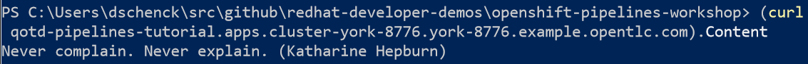
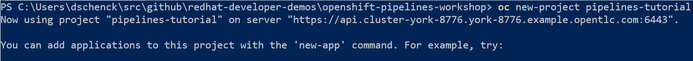
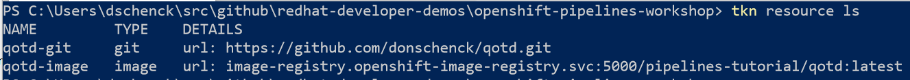

# openshift-pipelines-workshop
## Workshop to demonstrate OpenShift Pipelines (featuring Tekton).

**All** are welcome: Linux, macOS and Windows.

## Description
This workshop will guide you through the creation, execution and ongoing use of OpenShift Pipelines, a CI/CD instance that runs in an OpenShift cluster. You will learn how OpenShift Pipelines are installed, how they are configured, how they are run, how to handle the results, and how to continue a development cycle using this CI/CD environment.

## Table Of Contents
* [Introduction](#Introduction)
* [Prerequisites](#Prerequisites)
* [Workshop](#Workshop)
* [Optional Steps](#Optional)
* [Conclusion](#Conclusion)

## Introduction
Delivering working code is the goal of software developement. Undelivered code is worthless; we need to get bits into production. It's sometimes easy to lose sight of this given the distractions of new technologies, the latest methodologies, changing frameworks, etc. In the end, however, it's about working code running in production. In this workshop we'll start with a fresh, new OpenShift cluster and finish with an automated CI/CD system -- OpenShift Pipelines -- running in that cluster. Here, in one place, the end-to-end story.

As an optional step, we will then move forward, using the automated CI/CD system as we update and push source code. This will complete the cycle of creating source code, updating source code, and updating the compiled bits that are running in an OpenShift pod.

The engine for this is OpenShift Pipelines. OpenShift Pipelines relies on Tekton, the container-based build component of Knative, and runs in pods. Because each step runs in it's own pod, the benefits include scaling and the ability to run steps in parallel.

This example will feature code written in Go. A simple RESTful service, Quote Of The Day, will return a random quote via an HTTP Get request.

Example:

## Prerequisites
The following is a list of the environments and/or tools are necessary to perform this workshop. Details about each follow this list.
1. A terminal session on your PC
1. OpenShift version 4.3 (or newer) cluster
1. Tekton command line interface (CLI), `tkn`
1. OpenShift CLI, `oc`
1. Git
1. Git repo at https://github.com/redhat-developer-demos/openshift-pipelines-tutorial.git. You'll need to clone this repo to your machine.

### Prerequisite #1: A terminal session on your PC
You'll need to be able to run commands at the command line on your PC. Note that this workshop works with Linux and macOS (bash) and Windows (PowerShell). Where any differences occur in this workshop, commands for both environments will be supplied.

### Prerequisite #2: OpenShift version 4.3 (or newer) cluster
A not-trivial OpenShift 4.3 (or newer) cluster is necessary to run this workshop. Options include:
* Amazon Web Services (AWS)
* Microsoft Azure
* vmware vSphere
* Bare metal
* CodeReady Workspaces, which runs on your local machine and requires 32GB of RAM and at least four CPUs.

Visit the [OpenShift 4 web site at try.openshift.com](try.openshift.com) for instructions for your selected cloud-based infrastructure.

Visit the [CodeReady Containers web site](https://developers.redhat.com/products/codeready-containers) for instructions regarding CodeReady Containers.

### Prerequisite #3: Tekton command line interface (CLI), `tkn`
The Tekton CLI, `tkn`, is necessary. Note that this utility is built for your operating system of choice.

To install tkn, visit [the Tekton Pipelines cli github repo](https://github.com/tektoncd/cli#getting-started) and follow the instructions for your operating system.

### Prerequisite #4: OpenShift CLI, `oc`
The OpenShift CLI, `oc`, is necessary. Note that this utility is built for your operating system of choice.

To install oc, visit [the OpenShift version 4 clients download page](https://mirror.openshift.com/pub/openshift-v4/clients/ocp/latest/) and download the client for your operating. You'll need to decompress the downloaded file and make sure the resulting executable bits are in your system PATH variable.

### Prerequisite #5: Git
You'll need the Git tool installed on your machine. You can find the instructions at www.git-scm.com.

### Prerequisite #6: Git repo at https://github.com/redhat-developer-demos/openshift-pipelines-tutorial.git  

You will need the Git repo associated with this workshop.

`git clone https://github.com/redhat-developer-demos/openshift-pipelines-tutorial.git`

After cloning this repo, move into the directory where it is located (typically "openshift-pipelines-tutorial"). This will be the home directory for the remainder of this workshop.

## Workshop
The following list shows the seven steps that will be used to get our CI/CD pipeline up and running:
1. Create projects
1. Install operator
1. Create Pipeline
1. Create Tasks
1. Create Pipeline Resources
1. Run the Pipeline
1. View the results

  
 

<h4>Operators and Subscriptions Explained</h4>  

Because OpenShift is built on Kubernetes, it supports the concept of "Operators", or pre-built Customer Resource Descriptions (CRD) that include the sometimes many pieces needed to invoke a solution. In other words, a Kubernetes Operator can be used to start and maintain a complex solution. For example, there is a Kubernetes Operator that allows you to very easily get an instance of MongoDB running in your OpenShift cluster. There are others: Eclipse Che, Elasticsearch, Kafka, and dozens more.  

To invoke an operator *may* involve many steps. You install the Operator and the create a Subscription. In some cases, such as Kafka, you then invoke the API you want. For example, Kafka Connect or Kafka Topic.
  
For OpenShift Pipelines, one quick command will give us all we need.

### Workshop Step 0: Log in
Before any work can begin, you must be logged into your OpenShift cluster with cluster-admin rights. Use the `oc login` command to do this.

### Workshop Step 1: Create projects
Create an OpenShift project in which we'll be working.  

`oc new-project pipelines-tutorial`

Example:

### Workshop Step 2: Install operator
When it comes to installing the OpenShift Pipelines Operator, you have two choices: Use the web UI dashboard or use the command line. For this workshop, we'll be using the command line. 

#### Installing the Pipelines operator using the command line.  
This will install the Pipelines operator and make it available for use.  

`oc apply -f sub.yaml`

### Workshop Step 3: Create pipeline  
`oc create -f qotd-pipeline.yaml`

### Workshop Step 4: Create tasks  

`oc create -f https://raw.githubusercontent.com/openshift/pipelines-tutorial/master/pipeline/apply_manifest_task.yaml`

### Step 5: Create pipeline resources
We need to create two resources:
* qotd-git - defines the location of the github repo containing the source code to be compiled into an image
* qotd-image - defines the location of the created image

We'll need to run the command `tkn resource create` twice, once for each resource. Here are the values needed:

`tkn resource create`  
Name: qotd-git  
Type: git  
Url: https://github.com/donschenck/qotd.git  
Revision: (leave blank)  

`tkn resource create`  
Name: qotd-image  
Type: image  
Url: image-registry.openshift-image-registry.svc:5000/pipelines-tutorial/qotd:latest  
Digest: (leave blank)  

We can view the results by running `tkn resource ls`  

### Workshop Step 6: Run pipeline  
`tkn pipeline start build-and-deploy`

### Workshop Step 7: View results  

`oc get routes`

Use the route in your browser to navigate to the results. Refresh your browser several times to see random results.